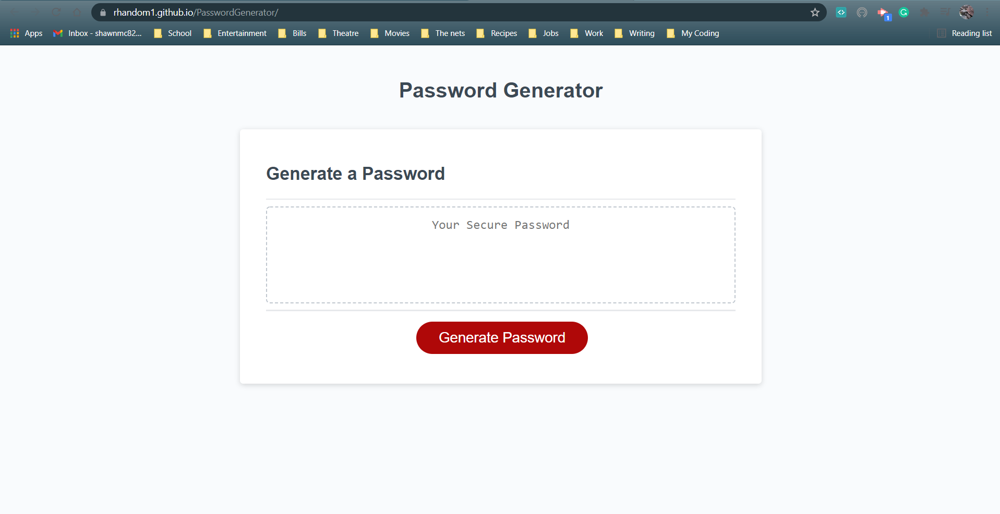

# Password Generator

## Purpose of this project is to create a password generator where the user can choose what criteria they would like to include in generating a new password. These are decided through 4 prompts and the choices are stored to generate a random password in the text box.

### Requested Criteria
Utilizing the code given which formed the framework of the application.
User must first confirm the length between 8 and 128 characters.
Set an alert for numbers below or greater than 8-128
Set up variables to contain the needed criteria
Set up 4 prompts that require only a Yes or No response to set the user criteria.
Set an alert to warn the user if they hit no on all 4 criteria options.
Once criteria has been established, a password will automatically generate inside the password text box.

#### Live link and Screenshots
Live link: https://rhandom1.github.io/PasswordGenerator/

